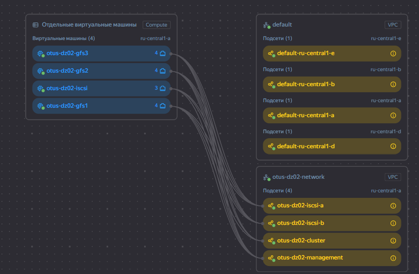
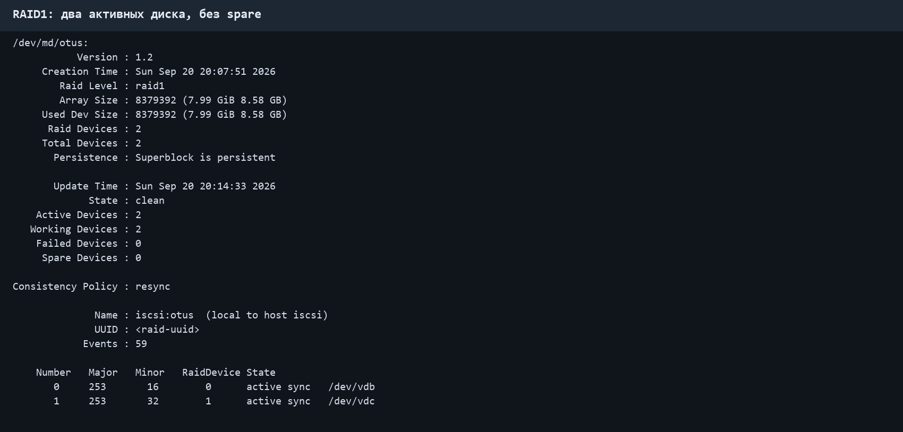
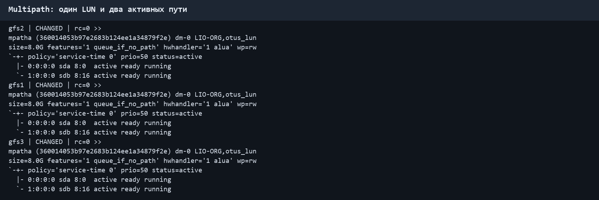
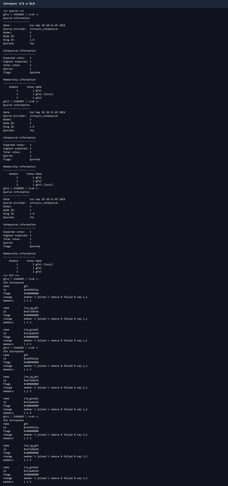
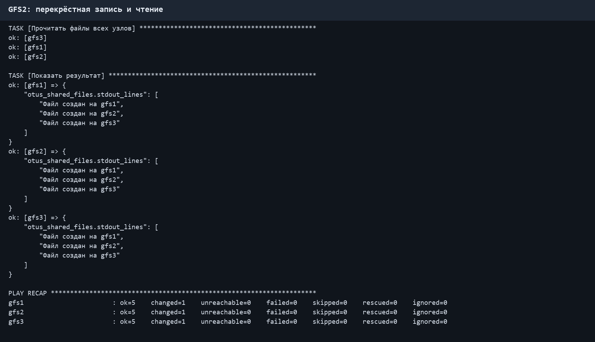

# OTUS_DZ02: общее хранилище GFS2 в Yandex Cloud

После первого домашнего задания логичным продолжением стало развёртывание архитектуры общего хранилища в уже подготовленном окружении Yandex Cloud. В работе использованы освоенные подходы к Terraform, сетевой настройке и SSH-доступу. Для второго задания создан отдельный набор ресурсов и конфигураций.

Первоначально стенд планировался в VirtualBox, но ресурсов ноутбука не хватило для устойчивой одновременной работы четырёх виртуальных машин. Поэтому итоговая конфигурация размещается в Yandex Cloud.

## Архитектура

Terraform создаёт один iSCSI-сервер и три узла GFS2.

```text
                    ┌──────────────────────────────┐
                    │ iscsi                       │
                    │ управление: 10.92.10.10     │
  2 × 8 ГБ ─ RAID1 ─│ iSCSI A:    10.92.30.10    │
                    │ iSCSI B:    10.92.40.10     │
                    └──────────┬───────────┬───────┘
                               │           │
                         путь A│           │путь B
                               │           │
                    ┌──────────▼───────────▼───────┐
                    │ gfs1, gfs2, gfs3            │
                    │ multipath → shared LVM      │
                    │ DLM → GFS2                  │
                    └──────────────────────────────┘
```

| Подсеть | Назначение | iSCSI-сервер | Узлы GFS2 |
| --- | --- | --- | --- |
| `10.92.10.0/24` | управление, SSH и Ansible | `.10` | `.11–.13` |
| `10.92.20.0/24` | Corosync | — | `.11–.13` |
| `10.92.30.0/24` | первый путь iSCSI | `.10` | `.11–.13` |
| `10.92.40.0/24` | второй путь iSCSI | `.10` | `.11–.13` |

У iSCSI-сервера три сетевых интерфейса. У каждого узла GFS2 четыре интерфейса. Пространства имён Linux не используются: подсети и маршрутизация Yandex Cloud дают необходимое разделение трафика.

Карта созданной инфраструктуры в Yandex Cloud:



Два дополнительных диска `network-hdd` по 8 ГБ объединяются в RAID1 без резервного диска. Полезная ёмкость массива составляет около 8 ГБ до расходов mdadm и LVM. Поверх RAID создаются LVM и один iSCSI LUN. Клиенты подключают один LUN через два портала, после чего multipath представляет его одним устройством `/dev/mapper/otus_lun`.

## Два уровня LVM

На iSCSI-сервере LVM создаётся поверх `/dev/md/otus` и используется для формирования одного общего LUN:

```text
2 × network-hdd 8 ГБ → RAID1 → PV → vg_target/lv_lun → iSCSI LUN
```

На `gfs1–gfs3` multipath объединяет два пути к этому LUN в `/dev/mapper/otus_lun`. Поверх него один раз, только на `gfs1`, создаётся общий LVM:

```text
iSCSI A + iSCSI B → multipath → shared PV/VG/LV → GFS2
```

Клиентский shared LVM нужен для выполнения требования задания, получения стабильного логического тома под GFS2 и согласованного управления метаданными LVM через `lvmlockd` и DLM. Это один общий `vg_gfs/lv_gfs`, видимый всем трём узлам, а не отдельный LVM на каждом узле. На `gfs2` и `gfs3` PV, VG и LV повторно не создаются: узлы обнаруживают и активируют уже созданный shared VG.

Технически GFS2 можно создать непосредственно на `/dev/mapper/otus_lun`, но в этом задании выбран слой shared LVM, поскольку он предусмотрен условиями работы.

Команды серверного уровня:

```bash
pvcreate /dev/md/otus
vgcreate vg_target /dev/md/otus
lvcreate -l 100%FREE -n lv_lun vg_target
```

Команды клиентского уровня выполняются только на `gfs1`:

```bash
pvcreate /dev/mapper/otus_lun
vgcreate --shared --locktype dlm vg_gfs /dev/mapper/otus_lun
lvcreate -l 100%FREE -n lv_gfs vg_gfs
mkfs.gfs2 -p lock_dlm -t otus:gfs -j 3 /dev/vg_gfs/lv_gfs
```

Работоспособность shared LVM и GFS2 подтверждается только после успешного завершения настройки, одновременного монтирования и перекрёстной записи на трёх узлах.

## Структура проекта

| Каталог | Содержимое |
| --- | --- |
| `terraform/` | сеть, подсети, группа безопасности, VM и диски |
| `ansible/roles/iscsi_server/` | RAID1, LVM и iSCSI target |
| `ansible/roles/gfs_node/` | iSCSI initiator, multipath, Corosync, DLM, shared LVM и GFS2 |
| `ansible/verify.yml` | перекрёстная запись и чтение файлов |
| `docs/screenshots/` | снимки фактически выполненных проверок |

Terraform, ключи и локальные параметры DZ02 хранятся отдельно от первого проекта. Каталоги `.tools/`, `.local/`, файл `terraform.tfvars`, inventory и Terraform state исключены из Git.

## Подготовка Terraform

Заполнить локальный файл по примеру:

```powershell
Copy-Item .\terraform\terraform.tfvars.example .\terraform\terraform.tfvars
```

В `terraform.tfvars` задаются идентификаторы облака и каталога, публичный ключ DZ02 и разрешённый адрес SSH. Значения этого файла в репозиторий не добавляются.

### Запуск с рабочего места Linux

Локальная копия Terraform устанавливается в тот же исключённый из Git каталог `.tools`:

```bash
python3 scripts/install_terraform.py
mkdir -p .local
ssh-keygen -t ed25519 -f .local/otus_dz02 -N ''
chmod 600 .local/otus_dz02
cp terraform/terraform.tfvars.example terraform/terraform.tfvars
# В terraform.tfvars указать путь .local/otus_dz02.pub.
export TF_CLI_CONFIG_FILE="$PWD/terraform.rc"
./.tools/terraform -chdir=terraform init
./.tools/terraform -chdir=terraform fmt -check
./.tools/terraform -chdir=terraform validate
./.tools/terraform -chdir=terraform plan -out=../.local/otus-dz02.tfplan
./.tools/terraform -chdir=terraform apply ../.local/otus-dz02.tfplan
./.tools/terraform -chdir=terraform output
```

Для Ansible создать отдельный ключ DZ02, ограничить права на него и заполнить локальные файлы из примеров:

```bash
cp ansible/inventory.example.ini ansible/inventory.ini
cp ansible/group_vars/gfs.example.yml ansible/group_vars/gfs.yml
cd ansible
ansible -i inventory.ini all -m ping --private-key ../.local/otus_dz02
ansible-playbook -i inventory.ini site.yml --private-key ../.local/otus_dz02
ansible-playbook -i inventory.ini verify.yml --private-key ../.local/otus_dz02
```

После остановки и последующего запуска VM повторно выполнить `./.tools/terraform -chdir=terraform output` и обновить публичные адреса в `ansible/inventory.ini`.

```powershell
$env:TF_CLI_CONFIG_FILE = "$PWD\terraform.rc"
.\.tools\terraform.exe -chdir=terraform fmt -check
.\.tools\terraform.exe -chdir=terraform init
.\.tools\terraform.exe -chdir=terraform validate
.\.tools\terraform.exe -chdir=terraform plan -out=..\.local\otus-dz02.tfplan
```

Создание ресурсов выполняется только после просмотра плана:

```powershell
.\.tools\terraform.exe -chdir=terraform apply ..\.local\otus-dz02.tfplan
.\.tools\terraform.exe -chdir=terraform output
```

План включает четыре VM `standard-v3` с 2 vCPU, 2 ГБ RAM и долей CPU 20%, четыре загрузочных диска по 15 ГБ, два диска RAID1 по 8 ГБ, четыре динамических публичных IP-адреса, одну облачную сеть, четыре подсети и одну группу безопасности.

## Чистое развёртывание стенда

Полный порядок действий при создании стенда с нуля:

1. Инициализировать Terraform:

   ```powershell
   $env:TF_CLI_CONFIG_FILE = "$PWD\terraform.rc"
   .\.tools\terraform.exe -chdir=terraform init
   ```

2. Проверить форматирование:

   ```powershell
   .\.tools\terraform.exe -chdir=terraform fmt -check
   ```

3. Проверить конфигурацию:

   ```powershell
   .\.tools\terraform.exe -chdir=terraform validate
   ```

4. Сформировать и просмотреть план:

   ```powershell
   .\.tools\terraform.exe -chdir=terraform plan -out=..\.local\otus-dz02.tfplan
   .\.tools\terraform.exe -chdir=terraform show ..\.local\otus-dz02.tfplan
   ```

5. Применить сохранённый план:

   ```powershell
   .\.tools\terraform.exe -chdir=terraform apply ..\.local\otus-dz02.tfplan
   ```

6. Получить актуальные публичные и внутренние адреса:

   ```powershell
   .\.tools\terraform.exe -chdir=terraform output
   ```

7. Заполнить локальный `ansible/inventory.ini` полученными публичными адресами. Внутренние адреса сетей управления, Corosync и iSCSI заданы статически.
8. На iSCSI-сервере обследовать два дополнительных диска командами `lsblk`, `wipefs -n` и `mdadm --examine`.
9. Настроить RAID1, серверный `vg_target/lv_lun` и один iSCSI LUN.
10. На каждом GFS2-узле подключить два iSCSI-пути и убедиться, что multipath показывает один WWID и два активных пути.
11. Запустить Corosync и дождаться кворума из трёх узлов.
12. Запустить DLM.
13. Запустить `lvmlockd`.
14. Только на `gfs1` создать общий PV, `vg_gfs` и `lv_gfs`.
15. Создать GFS2 с тремя журналами и смонтировать её на `gfs1–gfs3`.
16. Запустить `verify.yml` и проверить перекрёстную запись и чтение.

Обязательный порядок кластерного этапа:

```text
Corosync 3/3 → DLM → lvmlockd → shared LVM → GFS2
```

Ansible проверяет вывод `corosync-quorumtool -s`. Если кворума `3/3` нет, выполнение останавливается до запуска DLM и `lvmlockd`.

DLM и `lvmlockd` намеренно не включены в автоматический запуск при загрузке: они запускаются playbook только после проверки кворума. После перезапуска узлов следует повторно выполнить основной playbook, чтобы сохранить указанный порядок запуска.

Динамические публичные IP-адреса могут измениться после остановки и запуска VM. Внутренние статические адреса при этом сохраняются. После такого запуска сначала обновить состояние Terraform, затем повторно вывести адреса и обновить локальный inventory:

```powershell
.\.tools\terraform.exe -chdir=terraform apply -refresh-only
.\.tools\terraform.exe -chdir=terraform output
```

Команда `apply -refresh-only` обновляет только Terraform state и не изменяет облачную инфраструктуру.

## Настройка Ansible

Ansible запускается из Linux-окружения. После создания VM скопировать пример inventory и заменить четыре значения `PUBLIC_IP_...` выводом Terraform:

```bash
cd ansible
cp inventory.example.ini inventory.ini
ansible -i inventory.ini all -m ping --private-key ../.local/otus_dz02
```

Сначала проверить имена двух дополнительных дисков на сервере:

```bash
lsblk -o NAME,SERIAL,SIZE,TYPE
ls -l /dev/disk/by-id/
sudo wipefs -n /dev/disk/by-id/<диск-1>
sudo wipefs -n /dev/disk/by-id/<диск-2>
sudo mdadm --examine /dev/disk/by-id/<диск-1>
sudo mdadm --examine /dev/disk/by-id/<диск-2>
```

Записать проверенные пути в локальный `group_vars/storage.yml` и разрешить первичную настройку:

```yaml
otus_raid_devices:
  - /dev/disk/by-id/<диск-1>
  - /dev/disk/by-id/<диск-2>
otus_initialize_storage: true
```

Запустить роль сервера:

```bash
ansible-playbook -i inventory.ini site.yml --limit storage --private-key ../.local/otus_dz02
```

Проверить сервер:

```bash
cat /proc/mdstat
sudo mdadm --detail /dev/md/otus
sudo pvs
sudo vgs
sudo lvs
sudo targetcli ls
```

Затем запустить настройку клиентов. Первый проход подключает оба портала:

```bash
ansible-playbook -i inventory.ini site.yml --limit gfs --private-key ../.local/otus_dz02
ansible -i inventory.ini gfs -b -a 'iscsiadm -m session'
ansible -i inventory.ini gfs -b -a 'multipath -ll'
```

После проверки взять общий WWID из `multipath -ll`, записать его в локальный `group_vars/gfs.yml` и разрешить создание файловой системы:

```yaml
otus_lun_wwid: "<проверенный-WWID>"
otus_connect_iscsi: true
otus_initialize_gfs: true
```

Повторный запуск создаёт shared VG/LV и GFS2 один раз, затем монтирует файловую систему на трёх узлах:

```bash
ansible-playbook -i inventory.ini site.yml --limit gfs --private-key ../.local/otus_dz02
```

## Проверка результата

```bash
ansible -i inventory.ini gfs -b -a 'corosync-quorumtool -s'
ansible -i inventory.ini gfs -b -a 'dlm_tool ls'
ansible -i inventory.ini gfs -b -a 'mount | grep gfs2'
ansible -i inventory.ini gfs -b -a 'df -h /srv/gfs2'
ansible-playbook -i inventory.ini verify.yml --private-key ../.local/otus_dz02
```

`verify.yml` создаёт на каждом узле отдельный файл и читает все три файла на каждом узле:

```text
from-gfs1.txt
from-gfs2.txt
from-gfs3.txt
```

Фактические результаты сохранены в каталоге `docs/logs/`:

- `05-terraform-apply.txt` — создание 12 облачных ресурсов; идентификаторы ресурсов заменены на `<resource-id>`;
- `06-ansible-storage.txt` — создание RAID1, серверного LVM и iSCSI target;
- `08-multipath.txt` — один общий WWID и два активных пути на каждом узле;
- `09-ansible-gfs-create.txt` — запуск кластера и одновременное монтирование GFS2;
- `10-storage-cluster-status.txt` — RAID, iSCSI, multipath, кворум, DLM, shared LVM, `mount` и `df`;
- `11-gfs2-verify.txt` — перекрёстная запись и чтение трёх файлов;
- `12-raid1-final.txt` — итоговое состояние RAID1 после синхронизации.

Снимок карты облачной инфраструктуры находится в `docs/screenshots/01-yandex-cloud-map.png`.









## Остановка и удаление ресурсов

Чтобы временно остановить вычислительные ресурсы, VM можно остановить через консоль или YC CLI. Диски продолжают тарифицироваться. После сдачи удалить стенд Terraform:

```powershell
$env:TF_CLI_CONFIG_FILE = "$PWD\terraform.rc"
.\scripts\prepare_destroy.ps1
```

Сценарий создаёт локальный план удаления и показывает полный список ресурсов. После проверки применить именно сохранённый план:

```powershell
.\.tools\terraform.exe -chdir=terraform apply .\.local\otus-dz02-destroy.tfplan
```

Для ручного выполнения используются те же стадии:

```powershell
.\.tools\terraform.exe -chdir=terraform plan -destroy -out=..\.local\otus-dz02-destroy.tfplan
.\.tools\terraform.exe -chdir=terraform show ..\.local\otus-dz02-destroy.tfplan
.\.tools\terraform.exe -chdir=terraform apply ..\.local\otus-dz02-destroy.tfplan
```

Полный `destroy` удалит четыре VM, загрузочные диски, два дополнительных диска RAID1, сеть, подсети и группу безопасности. Перед применением плана необходимые данные с GFS2 следует сохранить отдельно. После удаления проверить отсутствие ресурсов и продолжающейся тарификации:

```powershell
.\.tools\yc.exe --config .\.local\yc-config.yaml compute instance list
.\.tools\yc.exe --config .\.local\yc-config.yaml compute disk list
.\.tools\yc.exe --config .\.local\yc-config.yaml vpc subnet list
.\.tools\terraform.exe -chdir=terraform state list
```

RAID1 защищает от отказа одного виртуального диска, но оба диска и iSCSI-сервер остаются в одной облачной архитектуре. Два iSCSI-пути заканчиваются на одном сервере и не устраняют эту единую точку отказа.

## Текущее состояние проверки

- `terraform fmt -check` выполнен;
- `terraform validate` выполнен успешно;
- чистое развёртывание Terraform выполнено: создано 12 ресурсов;
- RAID1 создан из двух дисков, оба участника активны, spare отсутствует;
- один iSCSI LUN доступен через два портала, multipath показывает два активных пути на каждом клиенте;
- Corosync собрал кворум `3/3`, DLM и shared LVM активны на трёх узлах;
- GFS2 одновременно смонтирован на `gfs1–gfs3`;
- `verify.yml` подтвердил запись отдельного файла каждым узлом и чтение всех трёх файлов на каждом узле.
